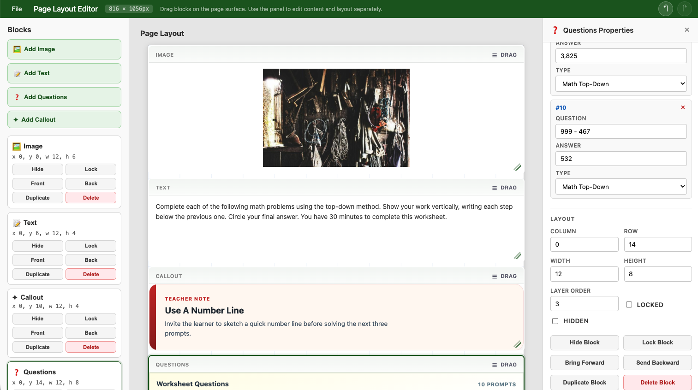

I didn't set out to build a generic page editor. I just needed a way to design structured pages in Angular for a couple of real projects. Teacher-facing generated question sheets for one. Flyer-style content for [Blazebite](https://blazebite.com) for another. That meant blocks of content, layout controls, editing, printing, JSON persistence, and a UI that didn't make me want to close my laptop.

At first I reached for some popular tools in this space. [Gridster](https://github.com/tiberiuzuld/angular-gridster2) is well-known for grid-based layouts. [GrapesJS](https://grapesjs.com/) is a full-blown web page builder framework. They're capable, and plenty of people use them well. But the more I dug in, the more I realized I was fighting their assumptions about what a "page" should be. I didn't want a dashboard builder. I didn't want a WYSIWYG website editor. I wanted something that felt like a document tool, and those libraries kept pulling me in other directions.

There was also the Angular [CDK](https://material.angular.io/cdk/categories) option, specifically its drag-and-drop module. On paper, that's the "right" answer for drag interactions in Angular. In practice, I've been burned by CDK before. If you've ever tried to keep CDK and Angular Material in sync across Angular version upgrades, you know the pain. Version conflicts, breaking changes in minor releases, peer dependency nightmares. I was reluctant to go down that road again, but after prototyping with all three, CDK actually seemed to have the clearest path forward. GrapesJS felt like the wild west, powerful but hard to wrangle into something predictable. Gridster had clear imperfections when it came to sizing certain page templates, and I kept hitting walls trying to get it to behave the way I needed.

So CDK seemed to be the answer going forward.

## Separating Content from Layout

Part of me wanted to keep refining with all three libraries in mind, prototyping each approach further, comparing trade-offs side by side. But I was doing a lot of this work with AI assistance, and the more libraries I kept in play, the more I worried about context rot and hallucinations. Three different APIs, three different mental models, three different sets of assumptions for the agent to juggle. That's a recipe for subtle, confident-sounding wrong answers. So I committed to CDK and focused on how to actually improve the editor itself.

The first version was, to put it charitably, a mess. Everything about a page element lived in one big blob: its content, its position, its size, its rendering behavior. Changing anything meant touching everything.

The breakthrough (and I'm using that word loosely, because it's really just "the obvious thing I should've done from the start") was separating content from layout.

The editor now thinks in three parts:

- **Content blocks** own the meaningful content and its schema
- **Layout blocks** own position, width, height, z-order, hidden state, and lock state
- **Page settings** define the grid and document dimensions

Once those concerns were pulled apart, a ton of previously messy behavior started making sense. Serialization got cleaner. Undo/redo stopped being scary. Collision detection had a clear place to live. Print/export behavior stopped fighting with edit behavior.

The JSON document format became something I could actually look at and understand. Not "whatever internal state the editor happened to be in," but a real format that could be saved, loaded, validated, and evolved without breaking everything.

## The Three-Part Rendering Model

For a while I kept treating "what fields can you edit" and "how does this block look" as the same concern. They're not, and conflating them made everything harder than it needed to be.

I ended up splitting things into three parts:

- **BlockSchema** defines what content fields exist and how the property panel edits them
- **BlockRegistry** defines block identity, defaults, and layout defaults
- **BlockRendererRegistry** defines how blocks actually render visually

Take a Questions block for teacher worksheets. That's domain-specific and shouldn't be hardcoded into the editor library. The library provides general rendering patterns, but the consuming app should own product-specific stuff like worksheet questions or fundraiser callouts.

So instead of jamming every possible block type into the library, the editor accepts host-provided Angular renderers keyed by `renderKind`. The host app defines the data model and visual presentation for its own custom blocks. The editor still handles the boring-but-hard stuff:

- layout and selection
- resizing and dragging
- collision behavior
- property panel behavior
- undo/redo
- print preview orchestration

That boundary kept the editor from slowly turning into a dumping ground for every product-specific thing I needed.

## Why Any of This Matters

This is connected to things I'm actually building.

The first use case is teacher-oriented generated content. Worksheet pages, question sets, classroom prompts, structured printable materials. A system generates question content, injects it into the document model, and a teacher can arrange or tweak things before printing. Not a rigid template, just enough structure that the output looks professional while still being editable.

The other use case is flyer and page composition for Blazebite. More promotional in nature: callouts, images, text blocks, structured layouts that end up as printable or shareable materials.

Those are pretty different domains. But the editor handles both because it cares about document structure, not domain-specific assumptions. That wasn't the plan from day one. It's just what happened when I kept peeling away the product-specific stuff and asking "what's actually the editor's job here?"

## Tests That Actually Helped

I don't always love writing tests. On this project, though, they shaped the design in a practical "I can actually change things without breaking everything" way.

Unit tests (via Vitest) locked down the stuff that's easy to accidentally break: layout rules, collision handling, serialization, block lifecycle, renderer fallback behavior, custom renderer contracts.

Browser smoke tests (via Playwright) caught the stuff that only shows up when real UI is involved: selection behavior, undo/redo in practice, collision feedback, resize interactions, host-rendered blocks actually rendering.

The real payoff was that I could keep simplifying the design aggressively. Every time I had an idea for a cleaner architecture, I could try it without spending the rest of the day manually clicking through every edge case. In a UI-heavy system, accidental regressions are practically guaranteed, so having that safety net mattered.

## Making It a Real Library

A lot of the later work was making this thing consumable by another Angular app that isn't mine.

That meant extracting a proper public API, deciding what's internal vs exported, documenting the package boundary, publishing to npm, writing consumer-facing setup guidance, and actually proving that a host app can own its own block registries and custom renderers without forking the library.

By the time I got to the [1.0.0 milestone](https://github.com/devandanger/page-layout-editor), it wasn't just "the page thing in this repo" anymore. It had an actual package shape and a real extension story.

## What 1.0.0 Actually Means

It doesn't mean "finished." It means "stable enough to use without apologizing."

The parts that feel solid:

- the document model
- the layout/content separation
- host-owned block schemas
- custom renderer injection via `BlockRendererRegistry`
- custom print adapters
- npm package consumption
- automated regression coverage on the core editing behaviors

The system feels intentional instead of experimental. I understand why things work, not just that they do.

## The One Thing I Keep Relearning

If there's a theme across this project, it's that things got better every time I made something more explicit.

Explicit document structure. Explicit layout rules. Explicit schemas. Explicit renderer boundaries. Explicit host responsibilities.

This ties back to the context rot problem I mentioned earlier. When you're working with AI agents, explicitness is how you keep the agent honest. The more explicit the boundaries, the easier it is for automation to catch its own mistakes. You can trust the tests to prevent hallucinations from shipping, but only if you've been intentional enough that there's something concrete to test against. Vague boundaries produce vague bugs. Explicit ones give the agent and the test suite something to recheck its assumptions against.

The result is a page layout editor that's easier to reason about, easier to extend, and aligned with the products it's supposed to support. That's all I wanted in the first place.

The project is on [GitHub](https://github.com/devandanger/page-layout-editor) and available on npm as `page-layout-editor`. Boring name, I know. You can tell a human named it and not a creative agent.