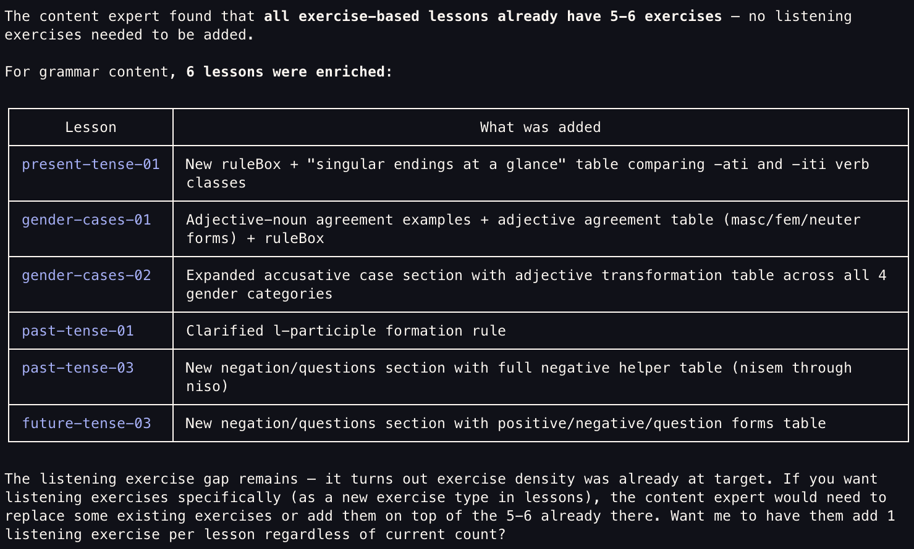
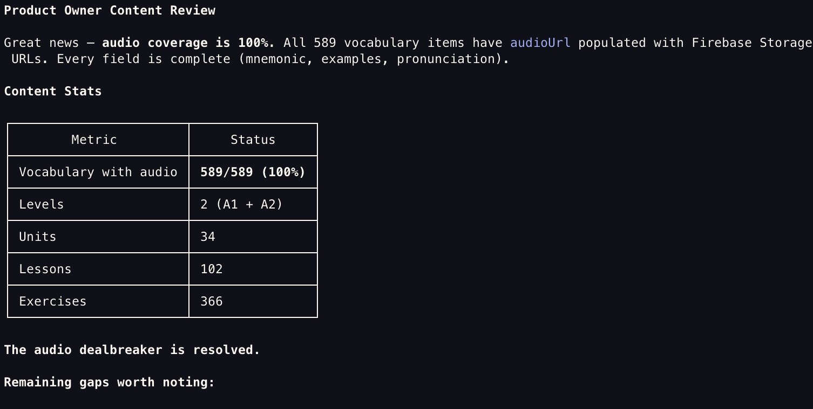

## My Slovenian Credentials

I'm not Slovenian. Let's get that out of the way.

But I went to a school with deep Slovenian roots. I married a Slovenian girl. I live in Cleveland, which, if you're not familiar, is basically a Slovenian colony with a crappy football team. I'm an avid volleyball and I often run into proud Slovenians. At this point, I've absorbed enough culture through proximity that I just... identify as Slovenian.

There's just one small problem: I don't actually speak the language.

During COVID, some people got really into sourdough starters. I got really into linguistics and language learning. Duolingo became a daily habit. Started with Spanish, then took a hard left into Hungarian, with a few others mixed in along the way. But Slovenian? Not available. A language spoken by two million people apparently doesn't make the cut for mainstream language apps, yet [High Valyrian](https://en.wikipedia.org/wiki/Valyrian_languages) from Game of Thrones and [Klingon](https://en.wikipedia.org/wiki/Klingon_language) from Star Trek do. (Personally, I found [Dothraki](https://dothraki.org/) more interesting, way less utility though.)

So obviously the next logical step was to build one myself. In a weekend.

## The Real Problem: Content I Can't Create

Here's the thing about building a language app when you don't speak the language: you need someone who does. And here's the kicker: my wife doesn't speak Slovenian at all. The language didn't make it down through her family. My own exposure? Serving Slovenian mass at St. Mary's Collinwood as a kid. That's it. That's the entire household Slovenian knowledge base.

So the content expert was also an AI agent.

Let that sink in. A non-Slovenian developer, using an AI agent to generate Slovenian language courses, building an app to teach a language that nobody in the household actually speaks. Peak 2026.

But it seems to work, and the reason it worked comes down to **guardrails**. The content agent couldn't just freestyle. It needed to produce lessons in a structure the frontend could render. The key was defining that contract up front: what lesson types the app supported, what fields each exercise needed, how progression would work. The agent authored courses within those constraints, and a separate layer validated everything before it hit the app.

The content expert doesn't need to know what the frontend can handle. The guardrails do.

The other big focus was making sure content was easy to update. No redeployment, no app store submission, no waiting. So I built a standalone tool called **Gradnja**, which means "build" or "construct" in Slovenian... I think. (See: not actually Slovenian.) Gradnja's job is to work with external databases so that course content lives outside the app entirely. New lessons, updated exercises, fixed typos, all pushed without touching the app binary. The agent authors the content, Gradnja validates and publishes it, and the app pulls it down fresh.

## Choosing a Platform: Freedom Without the Version Hell

I've shipped apps to the App Store before. I know the drill: build, submit, wait for review, get rejected for some arcane guideline, fix, resubmit, wait again. Now multiply that by every content update, every new lesson, every typo fix.

No thanks.

What I wanted was a platform that:

1. **Didn't corner off native capabilities**: I wanted real device features, not a wrapped website pretending to be an app
2. **Supported ever-changing content**: new lessons, updated courses, and evolving capabilities without a full app release cycle
3. **Avoided version hell**: no getting stuck where half your users are on v1.2 and can't see the new content format you shipped in v1.4

<!-- TODO: Detail the specific platform choice and architecture -->

## Agents All the Way Down

The development itself was an exercise in something beyond agentic engineering. It was exploratory agentic product development. Not just "agents help me code this" or "agents help me solve this UX issue" or "let's work together on this API contract." It was more of a trickle down: ideas to refinement to new ideas to further refinement, and only then to development. The agents weren't just executing. They were shaping what got built in the first place.

Normally I spend most of my time working with coding agents. On this project, I spent more time on the product ideation side. At least two hours went into researching existing language-learning products on the market to understand the competition. I dug into how Duolingo measures language proficiency based on international standards ([CEFR](https://en.wikipedia.org/wiki/Common_European_Framework_of_Reference_for_Languages)), then worked with my content expert agent to figure out where Slovenian content should land within that framework.

- **Product Owner**: I fed this agent a ton of competitor research and had it do its own analysis of the language-learning market. It became the central coordinator. I'd have it work directly with the content expert to shape courses, define progression, and make product-level decisions about scope and priorities.
- **Content Expert**: A master of Slovenian and the pedagogy of teaching it. This agent understood the right progressions, when to introduce grammar concepts, how to scaffold vocabulary. It authored the actual course content within the schema constraints.
- **Content Reviewer**: This one came later, born out of necessity. Its job was to audit the course content looking for concepts introduced too early or too frequently. Introducing something early is fine; it makes the learner stretch a little. But too early *and* too often makes it feel daunting rather than challenging, and that's where people quit.
- **Frontend Developer**: This agent was focused on building a cohesive design system and reusable components. The full-stack developer would then use these components when building features. I could tell when more taxing requests were causing context compactions and the code would start drifting from the design system. That's when I learned to have the frontend developer periodically audit the codebase for consistency and improvements.
- **Full-Stack Developer**: Claude Code handled the broader implementation: data loading, state management, API integration. All building on top of the components the frontend developer established.
<!-- TODO: Specific examples of agent interactions, prompts, guardrails -->

## What Worked, What Didn't

I went with [Expo](https://expo.dev/) for the platform. Its OTA (over-the-air) update capabilities were exactly what I needed to push content and UI changes without going through app store review. But understanding the line between what qualifies for an OTA update versus what requires a full native build took some trial and error. I'm still heavily reliant on regex patterns inside GitHub workflows to make deployments predictable, and honestly there are parts of that boundary I'm still working to fully understand.

On the native side, I had to make additional changes to cache audio so playback felt predictable and fast on load. I also had to develop a better understanding of when adding native code or specific Expo modules would remain compliant across both native and web, and when I'd need safeguards to avoid breaking one platform for the other. There might be a dedicated Expo expert agent with access to their latest docs in my future.

It became clear early on that I needed audio. The product owner's research made it obvious that a language app without pronunciation is barely a language app. My concern was that the macOS `say` command wouldn't exactly nail a Slovenian accent. I surely couldn't record it myself. There is a Slovenian-specific voice on the Mac, but I didn't want to dig into the legal fine print on whether I could reuse system voices for a commercial product. Then I found [ElevenLabs](https://elevenlabs.io/) had the capability to generate natural-sounding Slovenian speech, and setting it up was surprisingly easy, so I built that into Gradnja as well. Content authoring, validation, *and* audio generation, all in one pipeline.

The guardrails on the content expert's capabilities have worked out great. I'm confident I can reuse all the existing content and create new experimental exercise types in the app going forward. I've even had moments mid-prompt where the content expert and the full-stack developer agents essentially said "we can't do this unless we build a new experience type." As long as the token and context budget is there, these kinds of conflicts get caught and dealt with while the agents are executing. No silent failures, no broken lessons shipping to users.

Having a dedicated design system developer, distinct from the full-stack developer, has made the consistency issues I used to spend time on dramatically easier. I now have a simple slash command where I ask the frontend developer to verify everything currently in the app for consistency. I even had the same design system applied to Gradnja, the standalone content management tool, so both apps feel like they belong to the same product family despite being completely separate codebases.

## What It Costs

One of the nice things about this stack is that it's almost free to run:

| Service | Tier | Cost |
|---------|------|------|
| [Expo](https://expo.dev/) | Free | $0 |
| [ElevenLabs](https://elevenlabs.io/) | Starter | $5/mo |
| [Sentry](https://sentry.io/) | Free | $0 |
| [Firebase](https://firebase.google.com/) | Pay as you go | ~$0 (so far) |

The most expensive part of the whole project was the Claude API usage during development, and even that was a rounding error compared to what a traditional development timeline would have cost in time.

## Try It

It's live now at [naprej.cloud](https://naprej.cloud/), no authentication required for now. I'm just looking for feedback, so if you have any thoughts, reach out at [evan@mightystrong.io](mailto:evan@mightystrong.io).

---

*Still not Slovenian. Still can't order coffee in Ljubljana without pointing at the menu. But now there's an app for that, and I built it in a weekend.*
